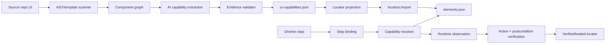

# Kế hoạch xây dựng Source UI Capability Registry cho TestPilot

**Mục tiêu:** dùng source của ứng dụng/UI library để cung cấp locator, component context, action và postcondition có bằng chứng cho self-healing.

**Vertical slice đầu tiên:** `them-ma-co-phieu.feature` trên web, màn `priceBoard`, tập trung vào `StockRow` và menu thao tác của mã `ADS`.

**Nguyên tắc an toàn:** source code chỉ tạo ra candidate. Locator chỉ được tin cậy hoặc promote sau khi chạy trên UI thật và action tạo đúng postcondition.

---

## 1. Kết quả cần đạt

Với bước:

```gherkin
When tôi mở menu tùy chọn của mã "ADS"
Then menu hiển thị chức năng "Sửa"
And menu hiển thị chức năng "Xóa"
```

TestPilot phải tạo được trace:

```text
step
→ intent=tap
→ screen=priceBoard
→ entity=stock:ADS
→ component=StockRow
→ element=priceBoard.stockRow.actionMenuButton
→ locator=row("ADS") >> testId:stock-row-actions
→ postcondition=menu Sửa/Xóa của dòng ADS hiển thị
```

Không được click một nút ba chấm toàn cục hoặc nút của dòng cổ phiếu khác.

### Chỉ số nghiệm thu

- 100% locator được import từ source có `file`, `line`, `expression` hợp lệ.
- Tỷ lệ action nhầm mục tiêu bằng 0 trong bộ PoC.
- Candidate không tạo đúng postcondition không được persist.
- Import không tạo element trùng với registry hiện tại.
- Các testcase đang pass không bị regression.
- Có thể giải thích vì sao một component/locator được chọn qua trace.

---

## 2. Kiến trúc đích



### Ba nguồn dữ liệu phải tách riêng

```text
registry/ui-source/             # dữ liệu sinh lại được từ source
  component-graph.json
  extraction/*.json

registry/ui-capabilities.json   # business capability đã reconcile

registry/elements.json          # locator runtime hiện tại, health và healing
```

Không ghi component graph trực tiếp vào `elements.json`. Regeneration từ source không được làm mất locator/health đã học từ runtime.

---

## 3. Những gì TestPilot đã có

| Năng lực | File hiện tại | Cách tái sử dụng |
|---|---|---|
| Registry logical element | `src/core/registry.ts` | Giữ làm nguồn locator thực thi |
| Kiểu `ElementDef`, `LocatorCandidate` | `src/core/types.ts` | Không thay đổi semantics hiện tại |
| Import locator library | `src/cli/locators-import.ts` | Dùng làm quality gate và merge vào registry |
| Gherkin step binding | `src/steps/binding.ts` | Bổ sung capability lookup sau bước xác định screen/intent |
| Runtime resolver | `src/runtime/resolver.ts` | Truyền component/entity context vào discovery |
| Semantic intent | `src/discovery/ElementIntent.ts` | Mở rộng bằng component/entity/effect |
| Candidate scoring | `src/discovery/ConfidenceScorer.ts` | Thêm điểm component/entity/action/effect |
| Action execution | `src/runtime/executor.ts` | Xác minh postcondition trước khi persist |
| Runtime locator provenance | `src/discovery/RuntimeRegistry.ts` | Giữ nguyên nguyên tắc chỉ tin locator đã verify |

Không xây lại các phần trên từ đầu.

---

## 4. Phase 0 — Baseline và fixture PoC

### Công việc

- [ ] Chốt source repository và commit cần phân tích.
- [ ] Xác định framework: React, Angular hay framework khác.
- [ ] Xác định route của Bảng giá và root component.
- [ ] Thu thập chuỗi component từ page tới `StockRow` và menu.
- [ ] Tạo fixture source tối thiểu trong test, không phụ thuộc toàn bộ source repo bên ngoài.
- [ ] Ghi baseline của scenario “Mở menu tùy chọn của dòng cổ phiếu”.

### Baseline cần ghi

- Element resolution có thành công không.
- Số candidate đã thử.
- Candidate tốt nhất và confidence.
- Thời gian discovery.
- Có click nhầm hay không.
- Postcondition nào thất bại.

### Done khi

- Có một fixture tái hiện trường hợp nhiều dòng cùng có nút menu.
- Test hiện tại fail đúng vì không có component/entity scope.

---

## 5. Phase 1 — Source scanner tất định

### File dự kiến

```text
src/source-ui/types.ts
src/source-ui/SourceScanner.ts
src/source-ui/ComponentGraph.ts
src/source-ui/frameworks/react.ts
src/source-ui/frameworks/angular.ts
src/source-ui/__tests__/SourceScanner.test.ts
src/cli/locators-extract.ts
```

Chỉ triển khai adapter cho framework thật của source app trong PoC. Adapter còn lại để sau.

### Scanner phải thu thập

- Route → root component.
- File, export name và component name.
- Import và component con.
- Props/Input/Output.
- JSX/template attributes.
- `data-testid`, `id`, `name`, `role`, `aria-label`, placeholder.
- Text literal và i18n key.
- Event handlers: click, input, change, submit, hover.
- Conditional render.
- List/row iteration và dữ liệu định danh entity.
- Dialog/menu/portal/overlay được mở.
- File và line cho mọi evidence.

### Output `component-graph.json`

```json
{
  "version": 1,
  "source": {
    "repository": "ui-repository",
    "commit": "abc123"
  },
  "routes": [
    {
      "path": "/tc-price",
      "screen": "priceBoard",
      "rootComponent": "PriceBoardPage"
    }
  ],
  "components": {
    "StockRow": {
      "file": "src/components/stock/StockRow.tsx",
      "parents": ["StockTable"],
      "children": ["RowActionMenu"],
      "bindings": [
        {
          "prop": "ticker",
          "source": "stock.symbol"
        }
      ],
      "sourceHash": "sha256:..."
    }
  }
}
```

### Ràng buộc

- Scanner không gọi AI.
- Scanner không tự đặt business name.
- Scanner không tự tạo CSS/XPath.
- Graph phải chống circular import và có giới hạn traversal depth.
- Chỉ đọc các file reachable từ route PoC.

### Done khi

- Graph thể hiện được `PriceBoardPage → StockTable → StockRow → RowActionMenu`.
- Mọi node có file và source hash.
- Test circular import và lazy component pass.

---

## 6. Phase 2 — AI capability extraction

### Chiến lược gọi model

Mỗi request chỉ chứa:

- Một component chính.
- Parent và child trực tiếp.
- Props/types liên quan.
- JSX/template rút gọn.
- Event handler liên quan.
- Route/screen đã biết.
- i18n value đã resolve.

Không gửi toàn bộ repository trong một prompt.

### System prompt

```text
Bạn là Source UI Capability Extractor cho hệ thống automation testing.

Nhiệm vụ:
- Xác định các control người dùng có thể thao tác.
- Xác định nội dung có thể assertion.
- Xác định action được source hỗ trợ.
- Xác định scope, entity binding, điều kiện hiển thị và postcondition.
- Trả về JSON đúng schema.

RÀNG BUỘC:
1. Chỉ sử dụng dữ liệu xuất hiện trong SOURCE_EVIDENCE.
2. Không tự tạo test id, role, label, text, CSS hoặc XPath.
3. Mọi locator phải có file, line và source expression làm bằng chứng.
4. Nếu hành vi nằm trong component con, đưa file đó vào requiredFiles;
   không suy đoán hành vi.
5. Không dùng nth-child, XPath tuyệt đối, class hash hoặc generated class.
6. Generic UI primitive như Button, IconButton, Menu không phải business
   component. Giữ component ứng dụng gần nhất làm owner.
7. Control trong bảng/list phải khai báo entityBinding hoặc báo thiếu bằng chứng.
8. Action phải có observable postcondition nếu source cung cấp postcondition.
9. Nếu không đủ bằng chứng, trả về unknown; không điền bằng suy đoán.
10. Không trả về markdown hoặc nội dung ngoài JSON.
```

### User prompt template

```text
REPOSITORY:
{{repository}}

COMMIT:
{{commit_sha}}

SCREEN:
{{screen}}

ROUTE:
{{route}}

COMPONENT GRAPH:
{{component_graph_fragment}}

SOURCE EVIDENCE:
{{source_evidence}}

OUTPUT SCHEMA:
{{capability_output_schema}}
```

### Output schema tối thiểu

```json
{
  "component": {
    "name": "StockRow",
    "file": "src/components/stock/StockRow.tsx",
    "screens": ["priceBoard"],
    "businessPurpose": "Một dòng mã cổ phiếu trong bảng giá",
    "parents": ["StockTable"],
    "children": ["RowActionMenu"],
    "entityBinding": {
      "type": "stock",
      "prop": "ticker",
      "evidence": "..."
    }
  },
  "elements": [
    {
      "proposedId": "priceBoard.stockRow.actionMenuButton",
      "businessNames": ["Menu tùy chọn của dòng cổ phiếu"],
      "kind": "button",
      "locators": [
        {
          "strategy": "testId",
          "value": "stock-row-actions",
          "file": "src/components/stock/StockRow.tsx",
          "line": 74,
          "expression": "data-testid=\"stock-row-actions\"",
          "confidence": 0.95
        }
      ],
      "actions": [
        {
          "type": "tap",
          "handler": "openMenu",
          "preconditions": ["StockRow visible"],
          "postconditions": ["RowActionMenu visible"]
        }
      ],
      "scope": {
        "component": "StockRow",
        "entityType": "stock",
        "entityParameter": "rowText"
      },
      "visibleWhen": []
    }
  ],
  "requiredFiles": [],
  "unknowns": []
}
```

### Vòng lặp `requiredFiles`

- [ ] Resolve path qua import graph.
- [ ] Scan file được yêu cầu.
- [ ] Gọi lại model với evidence bổ sung.
- [ ] Giới hạn tối đa 4 tầng.
- [ ] Không traversal toàn bộ UI library chỉ vì gặp generic primitive.

### Done khi

- Model xác định được business component owner.
- Model không gán ownership cho generic `Button`/`IconButton`.
- Control trong row có entity binding.
- Không có locator thiếu evidence.

---

## 7. Phase 3 — Evidence validation và reconcile

### File dự kiến

```text
src/source-ui/CapabilitySchema.ts
src/source-ui/EvidenceValidator.ts
src/source-ui/CapabilityReconciler.ts
src/source-ui/__tests__/EvidenceValidator.test.ts
src/source-ui/__tests__/CapabilityReconciler.test.ts
```

### Validation bắt buộc

- [ ] File evidence tồn tại.
- [ ] Line nằm trong file.
- [ ] Expression xuất hiện gần line đã khai báo.
- [ ] Locator value xuất hiện trong AST/template.
- [ ] Component reachable từ screen root.
- [ ] Action tương thích handler/control type.
- [ ] Element trong list/row có scope và entity binding.
- [ ] Locator vượt quality gate hiện tại.

### Locator phải loại

- `role=button` không có name.
- CSS chỉ là tên thẻ như `button`, `input`.
- `nth-child`.
- XPath tuyệt đối.
- CSS module/hash hoặc class sinh động.
- Selector không xuất hiện trong source evidence.

### Reconcile key

Theo thứ tự:

1. Cùng screen.
2. Cùng source component.
3. Cùng locator.
4. Cùng handler.
5. Cùng business label/alias.
6. Cùng postcondition.

Cùng label nhưng khác screen/component không được tự động merge.

### Done khi

- Evidence giả bị reject bằng test.
- Ba tên `addTicker`, `addStock`, `addStockButton` có thể merge vào logical element hiện có khi thực sự cùng control.
- Hai menu item `Sửa` ở hai business component khác nhau vẫn giữ riêng.

---

## 8. Phase 4 — Sinh locator library và import

### File dự kiến

```text
src/source-ui/LocatorProjection.ts
src/source-ui/__tests__/LocatorProjection.test.ts
registry/generated/source-locators.json
```

### Projection tương thích importer hiện tại

```json
{
  "version": 1,
  "screens": [
    {
      "id": "priceBoard",
      "title": "Bảng giá cổ phiếu"
    }
  ],
  "elements": [
    {
      "id": "priceBoard.stockRow.actionMenuButton",
      "label": "Menu tùy chọn của dòng cổ phiếu",
      "screen": "priceBoard",
      "platform": "web",
      "locators": [
        {
          "strategy": "testId",
          "value": "stock-row-actions",
          "weight": 0.9
        }
      ]
    }
  ]
}
```

### Chạy

```bash
npm run locators:import -- \
  --file registry/generated/source-locators.json \
  --dry-run
```

Review output rồi mới chạy:

```bash
npm run locators:import -- \
  --file registry/generated/source-locators.json
```

### Quy tắc

- Candidate source mặc định là `origin=llm`, `approved=false`.
- Import không overwrite locator healed/approved.
- Import không tự promote candidate.
- Import không tạo logical element mới nếu đã tìm được element hiện có bằng reconcile key.

### Done khi

- Dry-run giải thích rõ locator accepted/rejected.
- Diff `registry/elements.json` chỉ chứa thay đổi dự kiến.
- Health hiện tại không bị reset.

---

## 9. Phase 5 — Capability resolver cho Gherkin

### File dự kiến

```text
src/source-ui/CapabilityRegistry.ts
src/source-ui/CapabilityResolver.ts
src/source-ui/__tests__/CapabilityResolver.test.ts
```

### Input chuẩn hóa

```json
{
  "intent": "tap",
  "screen": "priceBoard",
  "target": "Menu tùy chọn",
  "entity": {
    "type": "stock",
    "value": "ADS"
  },
  "previousSteps": [],
  "nextSteps": [
    "menu hiển thị chức năng Sửa",
    "menu hiển thị chức năng Xóa"
  ]
}
```

### Thứ tự resolve

1. Xác định screen từ navigation/element trước/route/scenario plan.
2. Xác định action từ controlled vocabulary.
3. Trích xuất entity từ step và scenario variables.
4. Lọc capability reachable trên screen.
5. Lọc capability hỗ trợ action.
6. Nếu có entity, bắt buộc capability hỗ trợ entity scope tương ứng.
7. So business name/alias.
8. So postcondition với bước kế tiếp.
9. Chấm điểm.
10. Trả về resolved, ambiguous hoặc unresolved.

### Điểm đề xuất

| Tín hiệu | Điểm |
|---|---:|
| Đúng screen | +30 |
| Hỗ trợ đúng action | +25 |
| Entity type khớp | +25 |
| Business name/alias khớp | +20 |
| Component đang visible | +15 |
| Postcondition khớp bước kế tiếp | +15 |
| Component nằm trong current region | +10 |
| Locator có source evidence hợp lệ | +10 |
| Chỉ giống visible text | +3 |
| Sai screen | -50 |
| Có entity nhưng thiếu scope | -40 |
| Generic UI primitive | -20 |
| Component bị ẩn | -30 |

### Ngưỡng

- `>= 85`: chọn để runtime verify.
- `60–84`: yêu cầu thêm runtime evidence.
- `< 60`: reject.
- Hai candidate cách nhau dưới 10 điểm: ambiguous, không thao tác.

### Tích hợp

- Giữ `src/steps/binding.ts` là lớp bind controlled vocabulary.
- Capability resolver chạy sau khi đã biết action/screen và trước khi mint element mới.
- Nếu capability registry không tồn tại, behavior cũ phải giữ nguyên.

### Done khi

- “Mở menu ADS” chọn đúng `StockRow` scope.
- Không chọn row FPT hoặc menu toàn trang.
- Thiếu entity scope trả về ambiguous/unresolved thay vì click đại.

---

## 10. Phase 6 — Mở rộng intent, matcher và runtime verification

### Mở rộng `ElementIntent`

```ts
interface ElementIntent {
  // Các field hiện có...
  component?: string;
  entity?: {
    type: string;
    value: string;
  };
  expectedEffects?: string[];
}
```

### Matcher

Bổ sung điểm nhưng chỉ dựa trên runtime evidence:

| Tín hiệu | Điểm |
|---|---:|
| Same component | +20 |
| Same entity scope | +25 |
| Action compatible | +20 |
| Effect compatible | +15 |
| Generic primitive | -15 |
| Missing entity scope | -35 |

Không cộng `sameComponent` chỉ vì model nói component phù hợp. Runtime cần một trong các bằng chứng:

- Component root `data-testid`.
- DOM ancestry có scope đã biết.
- `data-component` hoặc metadata tương đương.
- Relative locator đã resolve đúng entity row.

### Relative locator cho row action

Mục tiêu:

```text
row("{{rowText}}") >> testId:stock-row-actions
```

Không dùng:

```text
button[aria-label="Tùy chọn"]
```

TestPilot đã có `template.kind=rowAction` và `locatorParams`; tái sử dụng thay vì tạo intent mới chỉ cho price board.

### Postcondition verification

Trước click:

```json
{
  "row": "ADS",
  "menuVisible": false
}
```

Sau click, cần ít nhất một bằng chứng mạnh:

- Menu mới xuất hiện.
- Menu có item Sửa/Xóa.
- Menu được anchor vào row ADS.
- `aria-expanded` đổi từ false sang true.

Nếu không đạt:

1. Đưa candidate vào `excludeCandidateKeys` của step hiện tại.
2. Không ghi locator.
3. Thử candidate tiếp theo.
4. Ghi trace lý do reject.

### Done khi

- Candidate click được nhưng không tạo state change bị reject.
- Candidate thứ hai tạo đúng menu được chọn.
- Chỉ candidate đã qua postcondition mới được đánh dấu verified/healed.

---

## 11. Phase 7 — Versioning và incremental refresh

### Metadata

```json
{
  "repository": "...",
  "commit": "...",
  "generatedAt": "...",
  "components": {
    "StockRow": {
      "sourceHash": "sha256:..."
    }
  }
}
```

### Luật refresh

- Component hash không đổi: reuse extraction.
- Component đổi: extract lại component đó.
- Dependency con đổi: reconcile lại parent liên quan.
- Locator biến mất khỏi source: đánh dấu `sourceStatus=stale`.
- Không xóa ngay locator runtime-verified.
- Chỉ expire locator cũ khi app version mới chứng minh locator không còn resolve được.

### Done khi

- Chạy extraction lần hai trên cùng commit không gọi AI lại.
- Sửa một component chỉ làm extract lại component và dependency liên quan.

---

## 12. Phase 8 — UI review và trace

### Nội dung cần hiển thị

- Source repository và commit.
- Component owner.
- File/line evidence.
- Business names/aliases.
- Supported actions.
- Entity scope.
- Locator candidates và quality score.
- Postcondition.
- Trạng thái: source-suggested, runtime-verified, healed, rejected, stale.

### Trace runtime

```text
[capability] step="Mở menu tùy chọn của mã ADS"
[capability] screen=priceBoard intent=tap entity=stock:ADS
[capability] component=StockRow score=125
[resolver] row("ADS") >> testId="stock-row-actions"
[verify] RowActionMenu visible, items=[Sửa, Xóa]
[registry] candidate runtime-verified
```

### Done khi

- Người review thấy được lý do chọn/reject locator mà không cần đọc raw JSON.
- Không có nút approve nếu evidence validation chưa pass.

---

## 13. Test plan

### Unit tests

- [ ] Extract đúng test ID, role/name và handler.
- [ ] Extract conditional render.
- [ ] Không extract class hash/nth-child/XPath tuyệt đối.
- [ ] Graph chống circular imports.
- [ ] Evidence sai file/line/value bị reject.
- [ ] Reconcile cùng control, khác tên.
- [ ] Không merge cùng label nhưng khác business component.
- [ ] Resolve đúng screen/action/entity.
- [ ] Ambiguous khi thiếu entity scope.
- [ ] Score không nhận generic primitive làm owner.

### Integration tests

- [ ] Nhiều row cùng có nút menu; chọn đúng ADS.
- [ ] Candidate đầu click nhưng không mở menu; candidate sau thắng.
- [ ] Menu render qua portal vẫn giữ quan hệ với trigger/row.
- [ ] Source locator chưa verify không thành primary.
- [ ] Import không làm mất healed locator.
- [ ] Không có capability registry thì workflow cũ vẫn chạy.

### Real-run tests

- [ ] Scenario “Mở menu tùy chọn của dòng cổ phiếu”.
- [ ] Chạy với ADS.
- [ ] Chạy với ít nhất một mã khác.
- [ ] Chạy lại 3 lần để kiểm tra ổn định.
- [ ] Chạy toàn feature `them-ma-co-phieu.feature`.
- [ ] So sánh baseline trước/sau: resolution rate, discovery time, candidate count và wrong-action rate.

---

## 14. Thứ tự pull request/commit đề xuất

### PR 1 — Data model và scanner

- `source-ui/types`
- component graph
- framework scanner cho PoC
- fixtures và unit tests

### PR 2 — AI extraction và evidence validation

- prompt builder
- structured output schema
- `requiredFiles` loop
- validator và reconciler

### PR 3 — Locator projection/import

- projection sang schema hiện tại
- mở rộng reconcile của importer
- dry-run report

### PR 4 — Capability resolution

- capability registry
- step → screen/action/entity/component mapping
- score và ambiguity gate

### PR 5 — Runtime postcondition

- intent context
- matcher scoring
- candidate rejection theo postcondition
- persist chỉ sau verification

### PR 6 — Review UI, trace và incremental refresh

- source evidence viewer
- trace component resolution
- source hash/commit refresh

Không gộp toàn bộ vào một commit; mỗi PR phải giữ test suite xanh và có fallback về behavior cũ.

---

## 15. Rủi ro và biện pháp

| Rủi ro | Biện pháp |
|---|---|
| Model bịa locator | Evidence validator đối chiếu AST/source |
| Source khác rendered DOM | Mọi candidate phải runtime verify |
| Click nhầm nhưng testcase vẫn đi tiếp | Postcondition bắt buộc trước persist |
| Generic UI library làm mất business context | Owner là app component gần nhất, primitive chỉ cung cấp locator evidence |
| File capability quá lớn | Extract theo route/component, incremental hash |
| Trùng logical element | Reconcile theo screen + component + locator + handler |
| Regeneration làm mất locator đã heal | Tách capability source khỏi runtime registry |
| Resolver chậm | Prefilter theo screen/action/entity trước AI/runtime discovery |
| Source repo không đúng version deploy | Gắn commit/app version và cảnh báo mismatch |

---

## 16. Quyết định bắt buộc trước khi code

- [ ] Source app là React hay Angular.
- [ ] Source nằm cùng workspace, Git submodule hay repo độc lập.
- [ ] Cách lấy commit tương ứng bản đang deploy.
- [ ] Có được thêm `data-testid` vào source app hay chỉ đọc source.
- [ ] Menu render inline hay qua portal/CDK overlay.
- [ ] Entity row có thuộc tính định danh ổn định nào ngoài visible text.
- [ ] Model nào dùng cho extraction và giới hạn chi phí/token.
- [ ] Capability registry có cần human approval trước runtime thử hay không.

---

## 17. Definition of Done toàn dự án

- [ ] Có command extract source theo route/screen.
- [ ] Có component graph và source hash.
- [ ] Có structured AI extraction với `requiredFiles` loop.
- [ ] Có evidence validation không phụ thuộc model.
- [ ] Có reconcile với logical element hiện tại.
- [ ] Có dry-run import.
- [ ] Gherkin resolve được screen/action/entity/component.
- [ ] Runtime locator có component/entity scope.
- [ ] Postcondition chặn click nhầm.
- [ ] Chỉ locator đã verify mới được persist/promote.
- [ ] Có trace và review UI.
- [ ] PoC `StockRow(ADS) → action menu` chạy ổn định.
- [ ] Toàn bộ test cũ pass.
- [ ] Wrong-action rate của bộ nghiệm thu bằng 0.

---

## 18. Bước triển khai đầu tiên

Thực hiện Phase 0 và Phase 1 trên đúng một route `/tc-price`:

1. Xác định framework và root component.
2. Thu thập chuỗi component tới `StockRow`.
3. Tạo fixture có hai row `ADS` và `FPT`, mỗi row có một menu button.
4. Viết test đỏ chứng minh resolver hiện tại chưa có đủ entity/component scope.
5. Xây `ComponentGraph` và scanner tối thiểu để test chuyển xanh.
6. Chưa gọi AI, chưa import locator và chưa thay đổi runtime trong bước này.

Đây là checkpoint đầu tiên: nếu graph không xác định đúng business component và entity binding thì chưa tiếp tục sang prompt/extraction.
